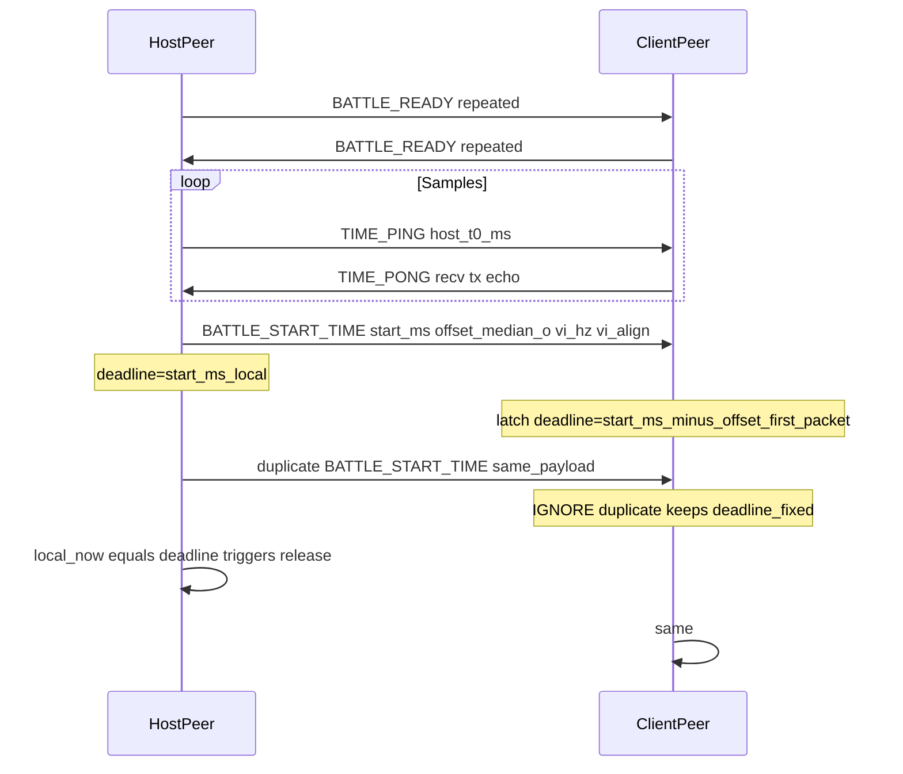

# Netplay matchmaking: control plane to battle start

Maintainer reference for **HTTP matchmaking** (`BattleShip-Server`) and **UDP P2P** (`port/net/sys/netpeer.c`) from ticket enqueue until **`syNetPeerCheckBattleExecutionReady`** / barrier release and input simulation.

High-level netplay behavior remains in [netplay_architecture.md](./netplay_architecture.md).

## Control plane vs data plane

| Plane | Transport | Role |
| ----- | --------- | ---- |
| Control | HTTPS to match server | Credentials, enqueue, poll match, heartbeats |
| Data | UDP (`syNetPeer` socket) | Automatch offers, bootstrap, battle barrier, clock sync, INPUT bundles |

## Phase A — Matchmaking service (HTTP)

- **Worker thread:** `port/net/matchmaking/mm_matchmaking.c` — jobs (`MmJob`) queued from main thread; responses drained via `mmMatchmakingDrainCompleted` → `MmMatchResult`.
- **Enqueue:** `POST /v1/queue` with JSON `udp_endpoint` (required, STUN reflexive or `SSB64_MATCHMAKING_PUBLIC_ENDPOINT` override) and optional **`lan_endpoint`** (same `host:port` shape as UDP bind for LAN reachability). When unset, the Linux client may fill **`lan_endpoint` via auto-detection** (see [`netplay_architecture.md`](./netplay_architecture.md) — VS Net Automatch).
- **Poll:** `GET /v1/match/{ticket}` — matched body includes `session_id`, **`peer`** (opponent reflexive endpoint), optional **`peer_lan`**, `you_are_host`, etc.
- **Heartbeat:** While **`queued`**, `POST /v1/heartbeat` refreshes queue presence. After **`matched`**, the server accepts heartbeat as a **no-op** for the ticket owner (avoids spurious client errors if a late heartbeat is in flight). The client also treats heartbeat **HTTP 404** as non-fatal during races.
- **UI:** `port/net/sc/sccommon/scautomatch.c` — CSS drives display only; **`mnVSNetAutomatchMatchmakingTick`** and P2P/bootstrap run from **`port/net/sc/sccommon/scnetmatchstaging.c`** after START loads **`nSCKindVSNetMatchStaging`**. On **`MM_POLL_MATCHED`**, **`mnVSNetAutomatchAMEnterVs`** completes LAN/reflexive **`syNetPeerRunBootstrap`** only (no immediate VS load). Staging calls **`syNetPeerStartVSSession`**, pumps **`syNetPeerUpdateBattleGate`** until **`syNetPeerCheckBattleExecutionReady`**, then loads **`nSCKindVSBattle`** via **`mnVSNetAutomatchAMFinalizeVsLoad`**. Automatch state leaves the poll/heartbeat loop immediately on match so periodic queue RPCs do not run during bootstrap.

## Heartbeat vs match state

Historically, `touch_heartbeat` only updated **`TicketState::Queued`** slots; **`matched`** tickets returned **404**, and the worker surfaced **`MM_POLL_ERROR`** → automatch error UI. **Current behavior:** (1) server **`Matched`** tickets return **200** for the owning `player_id` (no queue mutation); (2) client maps heartbeat **404** to success; (3) automatch FSM sets **`MN_AM_ENTER`** on match so poll/heartbeat timers are not armed during P2P bootstrap (see **`nSCKindVSNetMatchStaging`**, `mnVSNetAutomatchAMEnterVs`).

Support log markers (grep-friendly): `SSB64 Automatch LAN detect:` (`mm_lan_detect.c`); `SSB64 Matchmaking: heartbeat 404 (ignored, likely matched)` (`mm_matchmaking.c`, verbose).

## Auto-LAN summary

Implementation: `mmLanDetectEndpoint` in **`port/net/matchmaking/mm_lan_detect.c`**. Port from **`getsockname(udp_fd)`** or parsed from **`SSB64_MATCHMAKING_BIND`**. Address: first qualifying RFC1918 IPv4 on `getifaddrs`, scored to prefer typical physical prefixes (`en*`, `eth*`, `wlan*`) over `docker` / `br-` / `veth` / `virbr`. Override or pin with **`SSB64_MATCHMAKING_LAN_ENDPOINT`** and **`SSB64_MATCHMAKING_LAN_INTERFACE`**.

## Phase B — UDP configure and automatch negotiation

- **`syNetPeerConfigureUdpForAutomatch`** — parses bind and peer `host:port`, sets `sSYNetPeerSessionID`; provisional **`sSYNetPeerLocalPlayer` / `sSYNetPeerRemotePlayer`** (overridden when **`MATCH_CONFIG`** is applied).
- **`SYNETPEER_PACKET_AUTOMATCH_OFFER`** — fighter/stage-ban negotiation; **`syNetPeerAutomatchExchangeOffers`** (host waits for peer offer + composes metadata path; client completes when **`MATCH_CONFIG`** applied).
- **`syNetPeerComposeAutomatchMatchMetadata`** (host) — deterministic stage/fighters from both offers.

- **`SYNetInputReplayMetadata`** / **`MATCH_CONFIG`** (`SYNETINPUT_REPLAY_VERSION` / wire metadata v2) includes **`netplay_sim_slot_host_hw`** and **`netplay_sim_slot_client_hw`**: sim **controller indices** where each peer publishes **local hardware**, aligned with **`fighter_kinds[]`** column order (`0` = host pick, `1` = guest pick for 1v1 automatch). **`syNetPeerApplyBootstrapMetadata`** runs **`syNetPeerApplyInputSlotsFromMetadata`**: validates disjoint slots and (for 2P VS) requires **`0`/`1`**, then recomputes receive/sender slot lists so both peers match **`MATCH_CONFIG`** before **`syNetPeerStartVSSession`**. `slot_map` logs include **`meta_hw=...`**.

## Phase C — Bootstrap (`syNetPeerRunBootstrap`)

Returns **`TRUE`** only when the control handshake completes; on failure **`syNetPeerBootstrapFailTeardown`** closes the socket and clears bootstrap flags.

- **Host:** send **`MATCH_CONFIG`**, wait **`READY`**, send **`START`** (repeated).
- **Client:** receive **`MATCH_CONFIG`**, send **`READY`**, wait **`START`**.
- **Env path:** `syNetPeerInitDebugEnv` logs failure if bootstrap returns **`FALSE`**.

## Phase D — VS session and start barrier

- **`syNetPeerStartVSSession`** — per-frame gate via **`syNetPeerUpdateBattleGate`** → **`syNetPeerUpdateStartBarrier`**.
- **`SYNETPEER_PACKET_BATTLE_READY`** — both sides echo until **`sSYNetPeerBattlePeerReady`**; logs **`received BATTLE_READY`** when first seen.

### Taskman phase lock during barrier

Wall-clock + VI-quantized barrier release can still leave peers with different **`dSYTaskmanUpdateCount`** / **`dSYTaskmanFrameCount`** if the taskman loop kept advancing **scene_update** / **scene_draw** while **`syNetPeerCheckBattleExecutionReady()`** was false (faster vs slower `PortPushFrame` during the wait). Graphics and other code keys off **`dSYTaskmanFrameCount`** without decoupling from sim tick.

**Behavior (PORT):**

- While **`syNetPeerCheckBattleExecutionReady()`** is false **and** the scene manager reports **`nSCKindVSBattle`**, **`syTaskmanRunTask`** still **consumes** scheduler game ticks (same VI / message-queue cadence) but **does not** call the scene **`task_update`** / **`task_draw`** for that iteration and **does not** increment **`dSYTaskmanUpdateCount`** or **`dSYTaskmanFrameCount`**. It only calls **`syNetPeerUpdateBattleGate()`** so clock sync, `BATTLE_READY`, and `INPUT_BIND` keep making progress.
- On **`syNetPeerReleaseBattleBarrier`**, **`syTaskmanResyncCountersAfterNetBarrier()`** sets **`dSYTaskmanUpdateCount`** and **`dSYTaskmanFrameCount`** to **zero** so both peers start VS execution with the **same taskman phase**.
- **UX:** framebuffer may stay **static** during the barrier wait (until execution is ready).
- **A/B:** set **`SSB64_NETPLAY_TASKMAN_BARRIER_FREEZE=0`** to disable the freeze branch (legacy behavior).
- **Note:** a secondary **`dSYTaskmanFrameCount++`** exists in **`unref_8000641C`** (US gfx completion path); it is normally irrelevant during a pure barrier wait with no new gfx.

Implementation: [`port/net/sys/taskman.c`](/home/alex/Documents/GitHub/BattleShip/port/net/sys/taskman.c) when **`SSB64_NETMENU`** (mirrors and replaces the decomp TU); otherwise [`decomp/src/sys/taskman.c`](/home/alex/Documents/GitHub/BattleShip/decomp/src/sys/taskman.c). **`syNetPeerReleaseBattleBarrier`** in [`port/net/sys/netpeer.c`](/home/alex/Documents/GitHub/BattleShip/port/net/sys/netpeer.c). Deeper frame-phase notes: [netplay_frame_phase_audit.md](./netplay_frame_phase_audit.md).

**Why VS-only freeze:** If the barrier arms before **`nSCKindVSBattle`** (e.g. **`syNetPeerStartVSSession`** from **`nSCKindVSNetMatchStaging`**), a global taskman freeze would prevent the staging scene from running **`task_update`**, so **`syNetPeerUpdateBattleGate`** could not run and peers would deadlock. Staging owns “bootstrap complete → session start → gate pump → VS load”.

## Phase E — Timestamp / clock-sync contract

- Host runs a P2P multi-sample `TIME_PING` / `TIME_PONG` exchange, computes per-sample offset and NTP-style RTT (`(h3 - h0) - (c2 - c1)`), filters outliers, then chooses a filtered **median offset** plus conservative **lead RTT** for start scheduling.
- Host computes `start_ms = now + lead`; lead includes minimum lead, one-way RTT cushion (`lead_rtt / 2` + margin), jitter slack, optional uncertainty/fallback slack, and optional **`SSB64_NETPLAY_BARRIER_EXTRA_LEAD_MS`**.
- Client maps host start into local deadline using signed offset (`deadline = start_ms - offset`) and clamps to `now + slack` when a delayed packet would put the mapped deadline in the past.
- Time authority is intentionally **peer-to-peer only**; matchmaking server latency is not used to compute the contract.
- `BATTLE_READY` is a ready barrier, and both peers wait on **local clock vs agreed deadline** (`syNetPeerCheckBarrierDeadlineReached`) before release.
- **`syNetPeerReleaseBattleBarrier`** — reasons such as `clock-deadline-host`, `clock-deadline-client`, `client-ack`, `host-start`.
- **`BATTLE_START_TIME` (extended)** — after `start_ms` and median offset, the host sends **`barrier_vi_hz`** and **`barrier_vi_align`** (0/1). The guest applies these **before** deadline mapping / VI ceil quantization so **`gran_ms`** matches the host (`SSB64_NETPLAY_BARRIER_VI_HZ` / `…_VI_ALIGN` on the guest are overridden for that session). Legacy **28-byte** payloads remain valid; the guest keeps session-local env defaults for VI when omitted.

### Barrier flow (clock alignment) and `BATTLE_START_TIME` latch

When clock alignment is on, the barrier is satisfied only after **both** peers observe **their local wall-clock** crossing the negotiated deadline (`syNetPeerCheckBarrierDeadlineReached`). Rough order:

**TCP-style reliability on UDP:** The host repeats `BATTLE_START_TIME` for several frames (`SYNETPEER_BATTLE_START_REPEAT_FRAMES` in [`port/net/sys/netpeer.c`](/home/alex/Documents/GitHub/BattleShip/port/net/sys/netpeer.c)) **after** the barrier releases so guests that missed the first datagram still get the payload. Guests must treat the contract as **write-once**: re-decoding duplicates must not advance `deadline_ms` again (historic bug: repeating the “past deadline clamp” slid the barrier hundreds of milliseconds late vs host).

**Log cheat sheet**

| Prefix | Meaning |
| ------ | ------- |
| `barrier schedule host` | Negotiated `start_ms`, aggregate RTT/off lead line |
| `barrier schedule client` | First-pass mapped `deadline_ms` (+ optional one-time past-dead clamp); line includes effective **`vi_hz`**, **`host_contract`** (1 = used wire VI fields) |
| `ignore duplicate start_time (latched deadline)` | Benign UDP retransmit after guest latched contract |
| `barrier release` | Compare **`unix_ms=`** host vs guest; line also includes **`gran_ms=`**, **`vi_phase_bucket=`** (wall-clock bucket at release), **`contract_spread_ms=`** (host offset sample spread at latch; guest often **0**), **`skew_retries_latched=`** (host clock-sync retries consumed before this latch), **`taskman_frame=`** after resync (**0** when phase lock ran), **`scene_curr=`**, **`taskman_resync=`** (1 when `dSYTaskman*` reset + push-frame snap ran in **`nSCKindVSBattle`**), **`deadline_latched_ms=`** / **`deadline_vi_ph=`** (contract floor in VI buckets) |
| `execution begin` | VS sim may proceed past hold; includes **`push=`** (PortPushFrame), **`tm_up=`** / **`tm_fr=`** (taskman counters), **`scene=`** |
| `role=… tick=…` (periodic) | Every **`SYNETPEER_LOG_INTERVAL`** sim ticks: same **`push`**, **`tm_up`**, **`tm_fr`**, **`scene`** tail for drift vs peer logs |
| `tick_diag` (optional) | Set **`SSB64_NETPLAY_TICK_DIAG=1`** for extra **`SSB64 NetPeer: tick_diag`** / **`SSB64 NetSync: tick_diag`** lines; use **`=2`** on the host to log each **`clock_sync_sample`** after every **`TIME_PONG`** |
| `SSB64 Taskman: net_barrier_resync` | Logged when **`SSB64_NETPLAY_TICK_DIAG≥1`** and taskman counters are cleared at barrier release |
| `battle_exec_sync` | Host proposes frozen sim tick + **VI phase bucket** (`deadline_unix / gran_ms`); guest echoes same **vi_phase**; mismatch logs **WARN** |

### Contract skew gate (host) and sim VI phase (`BATTLE_EXEC_SYNC`)

After `TIME_PING` / `TIME_PONG` completes, the host runs `syNetPeerPickClockSyncMedians` and obtains **offset sample spread** (max − min among kept offset samples, in ms). If that spread exceeds **`SSB64_NETPLAY_BARRIER_MAX_CONTRACT_SKEW_MS`** (default **10**), the host **does not** send `BATTLE_START_TIME` yet: it calls `syNetPeerResetClockAlignState()`, increases the clock-sync sample target (capped at `SYNETPEER_CLOCK_SYNC_SAMPLES_MAX`), adds **+30 ms** per retry to the wall-clock lead budget (`sSYNetPeerBarrierEpochExtraLeadMs`), and collects another ping epoch. Up to **`SYNETPEER_BARRIER_SKEW_RETRY_MAX` (3)** retries; if spread is still high, the host **logs a WARN and latches anyway** (fail-open) so matches are not hard-deadlocked.

**`BATTLE_EXEC_SYNC` wire:** current builds send **`SYNETPEER_BATTLE_EXEC_SYNC_BYTES`** (28 bytes): fields through `peer_push_diag`, then **`vi_phase_bucket` (u32)**, then checksum. Legacy **24-byte** payloads are still accepted (**`vi_phase` treated as 0**). The bucket is `floor(barrier_deadline_unix_ms / barrier_frame_granularity_ms)` so both sides verify the same VI-aligned deadline phase before `syNetInput` ticks advance past the exec-sync gate.

**Misattributed “latency” checklist**

| Symptom | Often actually |
| ------- | ---------------------------- |
| “Both feel late from GO” | **Wall-clock barrier lead**: `SYNETPEER_MIN_START_LEAD_MS` + RTT-derived cushion + jitter slack + optional `SSB64_NETPLAY_BARRIER_EXTRA_LEAD_MS` (`netpeer.c`). |
| “Guests late vs host HUD” | **Fixed** duplicate `BATTLE_START_TIME` mishandling; verify no repeated `deadline in past -> clamp now+…` storms in guest log. |
| “Inputs drag behind HUD” | **Rollback delay** **`SSB64_NETPLAY_DELAY`** ticks — separate subsystem from barrier wall clock. |

### High RTT / long-distance P2P (no central time oracle)

Peers sync **against each other** only; HTTPS matchmaking discovers endpoints but **never** adjusts `deadline`.

- Larger RTTs directly increase aggregated lead budgets (more scheduling slack). Tune `SSB64_NETPLAY_BARRIER_EXTRA_LEAD_MS` only once barrier logs prove host/guest **`barrier release` unix timestamps** agree — otherwise masking implementation bugs invites double-padding.
- Asymmetric uplink/downlink and jitter buffers inflate RTT outliers; multi-sample discard + conservative max kept RTT help but cannot remove physics of distance.
- `CLOCK_REALTIME` (`clock_gettime` in `syNetPeerNowUnixMs`) can step/jump during NTP sync; mono-time RTT payloads are a plausible future tightening.
- Operational reality: WAN without relay means **holes + reordering**. Keep repeat sends; keep guest latch semantics.

Further architecture context: [netplay_architecture.md](./netplay_architecture.md).

## Phase F — Execution ready and battle simulation

- **`syNetPeerCheckBattleExecutionReady`** — when barrier released and rollback gate satisfied.
- **`sSYNetPeerPacketsSent` / `sSYNetPeerPacketsReceived`** — **INPUT** bundles only, not control packets (so barrier logs may show `sent=0 recv=0` at tick 0).
- **Rollback input delay (`SSB64_NETPLAY_DELAY` / `SSB64_NETPLAY_DELAY_MAX`)** — tags outbound INPUT ticks as `history_tick + delay`. Independently adapting delay per peer would desynchronize wire tick labels; **adaptive delay** is **host-authoritative**: only the host runs `syNetPeerMaybeAdaptInputDelay`, then broadcasts **`SYNETPEER_PACKET_INPUT_DELAY_SYNC` (14)** (`delay` + `effective_tick`) every **`SYNETPEER_ADAPT_DELAY_SIM_INTERVAL` (120)** sim ticks while execution-ready so the guest mirrors the host value (guest queues apply when `sim_tick >= effective_tick`). With fixed delay or adaptive disabled, sync packets are unnecessary. **`SSB64_NETPLAY_DELAY`** sets the initial delay and adaptive floor; **`SSB64_NETPLAY_DELAY_MAX`** caps the ceiling (see `syNetPeerInitDebugEnv` / automatch bootstrap). On noisy links, adaptive delay steps up when late-frame deltas spike or load-fail count rises, and steps down only after several consecutive stable intervals.

### Optional input-layer env (debug / WAN)

| Variable | Effect |
| -------- | ------ |
| `SSB64_NETPLAY_REMOTE_RING_CHECKSUM` | Non-zero: periodic **`SSB64 NetSync: remote_ring_hist_win=`** line — same window as published `hist_win`, folded over **`sSYNetInputRemoteHistory`** (wire-fed ring). Compare to `p0..p3` to separate publish/prediction skew vs wire disagreement. Also enabled when **`SSB64_NETPLAY_TICK_DIAG=2`**. |
| `SSB64_NETPLAY_INPUT_BUNDLE_REDUNDANCY` | Positive integer (≤ 8): append duplicate copies of the last N frames in each outbound INPUT bundle (same ticks, larger `frame_count`; checksum includes duplicates). Helps lossy Wi‑Fi at the cost of bandwidth. |
| `SSB64_NETPLAY_STALL_UNTIL_REMOTE` | Non-zero (Linux UDP): after resolve/publish, do not advance **`syNetInput`** tick until every remote human slot has a **`sSYNetInputRemoteHistory`** entry for the current tick — **debug only**; can hang if packets stop. |

- **Matcher:** `BattleShip-Server/src/matcher.rs` — stores each player’s **`udp_endpoint`** and **`lan_endpoint`**; on match, **`MatchPayload.peer`** is the other player’s reflexive endpoint, **`peer_lan`** is their LAN hint if present. **`TicketState::Matched`** records the owning **`player_id`** so **`POST /v1/heartbeat`** can succeed as a no-op after pairing (same authenticated player as the ticket).
- **Routes:** `BattleShip-Server/src/routes/mod.rs` — `POST /v1/queue` validates optional **`lan_endpoint`**.

## Failure and fallback

- **Automatch offer timeout** — log `automatch offer exchange timed out`; **`syNetPeerRunBootstrap`** returns **`FALSE`**; no VS load.
- **Bootstrap timeout** — host/client `bootstrap … timed out` logs; teardown; automatch UI calls **`mnVSNetAutomatchAMErr`** if LAN and reflexive candidates both fail.
- **Dual candidate order** — try **`peer_lan`** (if non-empty), then **`peer`**; **`port_log`** lines `reachability candidate=lan|reflexive`.

When changing wire sizes, packet types, barrier ordering, `SYNETPEER_METADATA_BYTES` / replay metadata layout, or match JSON, update this file in the same change when practical. Packet type ids **10** and **11** remain reserved for compatibility (retired warmup handshake). `SYNETPEER_BATTLE_EXEC_SYNC` grew from 24 to **28** bytes (added `vi_phase_bucket`); legacy 24-byte payloads are still accepted inbound. `BATTLE_START_TIME` extended layout is **36** bytes (adds **8** bytes: `vi_hz` + `vi_align` before checksum); **28-byte** payloads remain accepted inbound for older hosts. **`INPUT_DELAY_SYNC` (14)** is **24** bytes: `delay` (u32) + `effective_tick` (u32) before checksum.
